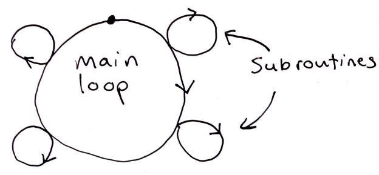

| title | date |
|---|---|
| T-Shaped Integration in MM-M | 10/19/2022 17:32 |

In the chapter _The MM-M after 20 Years_ Brooks retrospects on his essay ['Build
One to Throw Away'](1664251484.md). He determines that a shortcoming of his essay
was its implicit reliance on waterfall-development, and that now (at the time of
writing) he believes incremental development is the way to go. Brooks goes on to
describe a development process quite like [T-Shaped integration](1661984656.md) 
in _Code Complete_ and ['Tracer Bullets'](1661985707.md) in 
_The Pragmatic Programmer_. 

He says that one should build a basic main loop for the system, and then 
incrementally develop modules to support new funcions. Apparently the model 
Brooks illustrates is one that was advocated at the time by Harlan Mills:

### References
- _The Mythical Man-Month, Frederick Brooks Jr._
