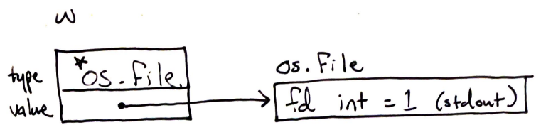

| title | date |
|---|---|
| Go Interface Dynamic Types and Values | 11/14/2022 20:57 |

The value of an interface type, or an **interface value** has both a **dynamic
type** and a **dynamic value**. Consider the example 
[assigned interface variable](1666838565.md) `w`:

```
var w io.Writer
w = os.Stdout
```

Although the variable `w` has interface type `io.Writer`, we say it has the 
**dynamic type** `*os.File`. The **dynamic value** is actually the underlying
file descriptor, in this case `os.Stdout`.



The compiler generates code that looks up the `Write()` method for `w`'s 
dynamic type, and passes in the interface's dynamic value when called. 

### References
_The Go Programming Language, Alan A.A. Donovan, Brian W. Kernighan_
